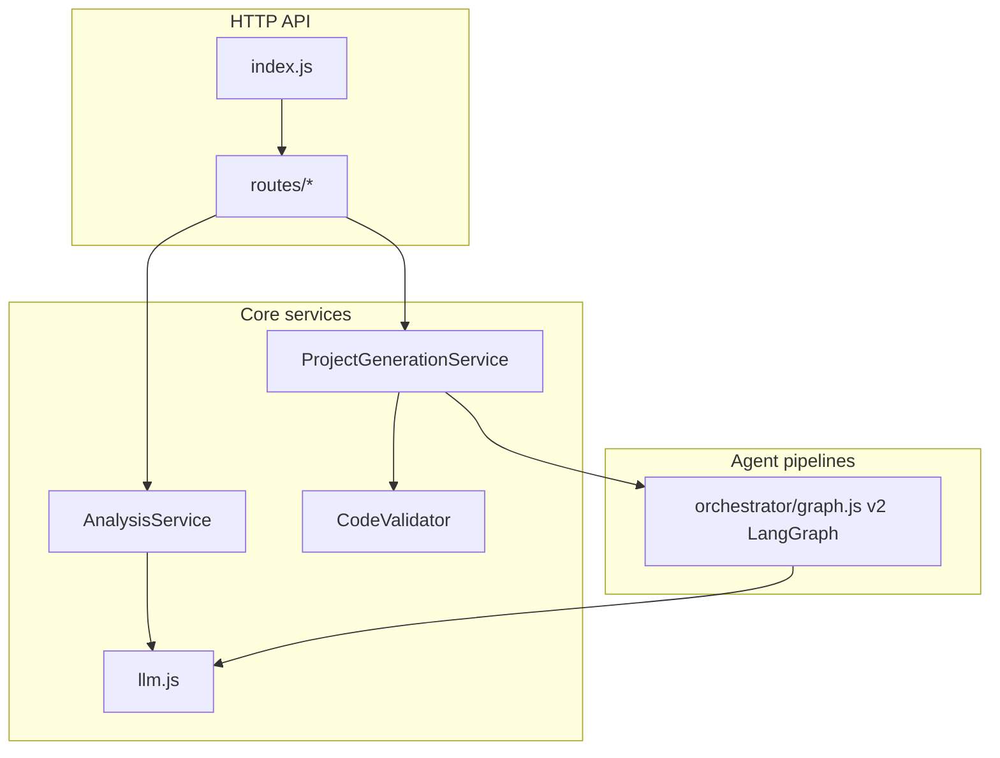

# Backend Technical Documentation (CTO / Senior Engineering)

This document is derived strictly from the repository under `backend/`. **Accuracy notes:** (1) [`src/config.js`](src/config.js) documents optional LLM providers (`anthropic`, `openai`), but [`src/services/llm.js`](src/services/llm.js) implements **Google Gemini only** via `@google/genai`. (2) When `DATABASE_URL` is set, PostgreSQL stores generation events and related records; otherwise persistence is the filesystem / S3-backed storage, LRU in-memory caches, and runtime log files. (3) [`recordGeneration`](src/routes/metrics.js) writes metrics to the DB when configured, or an in-memory FIFO store; it is invoked from the generate route after each run completes (success or structured failure).

---

## 1. Directory and file structure

Complete listing (excluding `node_modules/`; includes config, logs, and local env files that may be present in a developer workspace):

```
backend/
├── .DS_Store
├── .dockerignore
├── .env
├── .env.example
├── BACKEND_REFACTOR.md
├── Dockerfile
├── fly.toml
├── logs/
│   ├── app.log
│   └── error.log
├── package-lock.json
├── package.json
├── scripts/
│   └── check-build.mjs
├── src/
│   ├── agents/
│   │   ├── coder/          (agent.js, context.js, prompts.js, tools.js)
│   │   ├── editor/         (agent.js, differ.js, prompts.js, tools.js)
│   │   ├── fixer/          (agent.js, prompts.js, tools.js)
│   │   ├── orchestrator/   (graph.js, router.js, state.js)
│   │   ├── planner/        (agent.js, prompts.js, tools.js, validators.js)
│   │   ├── reviewer/       (agent.js, prompts.js, tools.js)
│   │   ├── shared/         (contracts.js, errors.js, events.js, memory.js, metrics.js, prompt-catalog.md)
│   │   └── index.js
│   ├── config.js
│   ├── index.js
│   ├── logs/
│   │   ├── app.log
│   │   └── error.log
│   ├── routes/
│   │   ├── analyze.js, auth.js, bundle.js, download.js, edit.js, generate.js, health.js, metrics.js, plan.js, v1/…
│   ├── services/
│   │   ├── agentFixer.js, analysis.js, bundler.js, cache.js, llm/, logger.js,
│   │   │   projectGeneration.js, queue/, retry.js, storage/, templates.js, usage.js, validator.js, zipper.js
│   └── validation/
│       └── requirements.js
└── test/
    ├── agents/… (unit tests under coder, editor, orchestrator, planner, reviewer, shared)
    ├── api.test.js, problematic_html.test.js
    ├── benchmarks/ (compare.js, framework.js, prompts.js, run.js, *.md, *.json)
    ├── run-v2-tests.sh
    ├── services/ (retry, templates, validator tests)
    ├── v2-integration/ (happy-path.test.js, harness.js)
    └── v2-live/ (smoke scripts, prompt-issues.md, smoke-runner.js)
```

---

## 2. Backend architecture overview

- **Style:** Single **Node.js monolith** (one HTTP server process), not microservices.
- **Layers:** **Routes** (Express routers) → **Services** (domain logic: analysis, generation, validation, bundling) → **Agents** (v2 multi-agent LangGraph with Planner/Coder/Reviewer/Fixer/Editor).
- **Patterns:** **Dependency injection** of services into router factories (`createAnalyzeRouter`, etc.); **Template Method** in `ProjectGenerationService` for file generation; **Circuit breaker / retry** in `RetryHandler`; **LRU caching** for analysis/plan.
- **Frameworks/libraries:** Express 5, Helmet, CORS, compression, express-rate-limit, Winston, LangChain LangGraph, `@google/genai`, Babel (bundler), archiver (ZIP), dotenv.



---

## 3. Request lifecycle (end-to-end)

1. **Startup:** [`src/index.js`](src/index.js) loads `dotenv` indirectly via [`src/config.js`](src/config.js), creates `http.Server`, applies global middleware (Helmet, compression, CORS, JSON 10mb, request timing log), mounts rate limiters on `/api/`, instantiates `AnalysisService` and `ProjectGenerationService(GENERATED_DIR)`, wires routes, dynamic-imports [`src/agents/index.js`](src/agents/index.js) to preload the v2 pipeline, registers graceful shutdown on SIGTERM/SIGINT.
2. **Typical JSON API:** Client sends POST → `apiLimiter` / `generationLimiter` as applicable → Express body parser → route handler validates input → service method → LLM via `generateCompletion` or cache → JSON response.
3. **Generation (SSE):** POST `/api/generate` sets SSE headers, registers `activeGenerations` lock per client id (`X-Session-Id` or IP), calls `ProjectGenerationService.generateProject` with callbacks that `write` SSE events (`status`, `file_chunk`, `file_generated`, `generation_complete`, `generation_error`). Client disconnect clears the lock. On completion, metrics may be recorded via [`recordGeneration`](src/routes/metrics.js).
4. **Persistence:** Generated files written under `generated/project_<uuid>/` on disk; download via `/download/:projectId` zips that directory.
5. **Database (optional):** When `DATABASE_URL` is set, `pg` + SQL migrations under `src/db/migrations/`; no ORM.

---

## 4. Routing and API layer

| Method | Path | Handler / module | Purpose |
|--------|------|------------------|---------|
| GET | `/health` | [`src/routes/health.js`](src/routes/health.js) `router.get` | Liveness: uptime, version, `agentVersion`, `v2Available`, supported frameworks. |
| GET | `/download/:projectId` | [`src/routes/download.js`](src/routes/download.js) | Zip on-disk generated project; path traversal guards. |
| POST | `/download/zip` | [`src/routes/download.js`](src/routes/download.js) | Build ZIP from JSON `files` map (max 200 files). |
| POST | `/api/analyze` | [`src/routes/analyze.js`](src/routes/analyze.js) | Body: `prompt`, optional `framework`/`styling`. Returns analysis + `sessionId` (UUID). |
| POST | `/api/plan` | [`src/routes/plan.js`](src/routes/plan.js) | Body: `requirements` object; validated by [`src/validation/requirements.js`](src/validation/requirements.js). Returns plan JSON. |
| POST | `/api/generate` | [`src/routes/generate.js`](src/routes/generate.js) | SSE: requires `prompt`, `requirements`, `plan` with non-empty `files`. 409 if concurrent generation for same client id. |
| POST | `/api/bundle` | [`src/routes/bundle.js`](src/routes/bundle.js) | Body: `files` object → [`bundleProject`](src/services/bundler.js) for preview bundling. |
| POST | `/api/edit` | [`src/routes/edit.js`](src/routes/edit.js) | SSE: `editType` (`direct` \| `prompt` \| `feature`), `payload`, `currentFiles`; runs [`EditorAgent`](src/agents/editor/agent.js). |
| GET | `/api/metrics/generations` | [`src/routes/metrics.js`](src/routes/metrics.js) | Aggregated generation stats; DB-backed when configured, else in-memory FIFO (100). |

**Middleware summary:** Helmet (CSP disabled), compression, CORS (prod: configured origins), `express.json`, custom request logger (skips `/health`), `apiLimiter` on `/api/*`, `generationLimiter` on analyze/plan/generate/edit.

---

## 5. Data flow and dependencies

- **Analysis path:** User prompt → `AnalysisService.analyzePrompt` → LRU cache or `generateCompletion` + JSON parse/normalize → client.
- **Plan path:** Requirements → `validateRequirements` → `AnalysisService.generatePlan` → cache or LLM → normalized plan with `files`, `techStack`, `designSystem`.
- **Generation path:** Plan + requirements → `ProjectGenerationService.generateProject` → `runGenerationGraphV2` → per-file streaming via `generateCompletionStream`, validation via `CodeValidator`, repair via `AgentFixer`, fallback via `getTemplate` from [`src/services/templates.js`](src/services/templates.js).
- **Bundling path:** In-memory file map → Babel transform in [`src/services/bundler.js`](src/services/bundler.js) for preview HTML/JS.
- **Edit path:** `currentFiles` → `ProjectMemory` + `EditorAgent` + SSE via `AgentEventEmitter`.

**Shared utilities:** [`src/services/logger.js`](src/services/logger.js) (Winston), [`src/config.js`](src/config.js), [`src/services/cache.js`](src/services/cache.js), [`src/services/retry.js`](src/services/retry.js).

---

## 6. File-level documentation

Paths relative to `backend/`.

### Root and deployment

- **`package.json`** — NPM manifest: `type: module`, scripts `start`/`dev` on port 5001, `test` via Node test runner, `build` runs `check-build.mjs`. Declares Express, Gemini/LangGraph, Babel, archiver, Winston, etc.
- **`package-lock.json`** — Locked dependency tree for reproducible installs.
- **`.env.example`** — Documents env vars: `GEMINI_API_KEY`, `PORT`, CORS, LLM tuning, rate limits, generation timeouts, logging.
- **`.env`** — Local secrets (not committed in healthy workflows; same keys as example).
- **`.dockerignore`** — Excludes files from Docker build context (reduces image size).
- **`Dockerfile`** — Node 22 Alpine: `npm ci --omit=dev`, copy source, `npm run build`, exposes 5001, `CMD npm start`.
- **`fly.toml`** — Fly.io app config: internal port 5001, HTTP health check `GET /health`, auto stop/start machines.
- **`DEPLOY.md`** — Deploying on Fly: secrets, scaling, health checks. PostgreSQL is expected from **Supabase** (or any reachable URL via `DATABASE_URL`); Fly Postgres is not required.
- **`BACKEND_REFACTOR.md`** — Project narrative / refactor notes (markdown; not executable).

### Scripts and logs

- **`scripts/check-build.mjs`** — Sets `BUILD_CHECK=1`, dynamic-imports `src/index.js` to verify imports load; prevents server listen during Docker build.
- **`logs/app.log`**, **`logs/error.log`** — May be used if Winston paths resolve here in some deployments.
- **`src/logs/app.log`**, **`src/logs/error.log`** — Winston file transports from [`src/services/logger.js`](src/services/logger.js) (`services/../logs` → `src/logs`). Prefer one canonical log directory in production.

### Core entry and configuration

- **`src/index.js`** — Application entry: Express + HTTP server, middleware stack, service singletons, route mounting, v2 agent preload, graceful shutdown, exports `app` for tests. **Inputs:** env. **Outputs:** listening server (unless `BUILD_CHECK`).
- **`src/config.js`** — Central config from `process.env`: port, CORS, LLM (Gemini-first keys), rate limits, generation timeouts, agent limits, cache sizes, `agentVersion`, framework/styling lists. **Dependencies:** `dotenv`.

### Routes

- **`src/routes/health.js`** — `GET /health`; attempts import of `agents/index.js` to set `v2Available`. **Dependencies:** `config.js`.
- **`src/routes/analyze.js`** — `POST /` → `analysisService.analyzePrompt`. Validates prompt length ≤ 10000. **Outputs:** JSON analysis + `sessionId`.
- **`src/routes/plan.js`** — `POST /` → `validateRequirements` + `analysisService.generatePlan`. **Outputs:** plan JSON or 400 with `fields`.
- **`src/routes/generate.js`** — `POST /` SSE pipeline; `getClientId` from `X-Session-Id` or IP; concurrency guard; wires callbacks to `ProjectGenerationService.generateProject`; calls `recordGeneration` when a `metricsRecord` is returned. **Outputs:** SSE events.
- **`src/routes/download.js`** — `GET /:projectId` zips directory under `generatedDir`; `POST /zip` builds zip from body. **Dependencies:** `zipper.js`, `logger.js`.
- **`src/routes/bundle.js`** — `POST /` → `bundleProject`. **Dependencies:** `bundler.js`.
- **`src/routes/edit.js`** — `POST /` SSE; builds `ProjectMemory` from `currentFiles`, `EditorAgent` with validator + generation service. **Dependencies:** `memory.js`, `events.js`, `editor/agent.js`.
- **`src/routes/metrics.js`** — `GET /generations` aggregates in-memory store; exports `recordGeneration`.

### Services

- **`src/services/logger.js`** — Winston logger: console + rotating files under `src/logs`. **Dependencies:** `config.js`, `winston`.
- **`src/services/llm.js`** — **Gemini-only** runtime: `initializeModel`, `generateCompletion`, `generateFix`, `generateCompletionStream`; large prompt constants (`ANALYZER_PROMPT`, `PLANNER_PROMPT`, framework prompts), `buildCodeGenPrompt`, `buildContextPrompt`, `getMaxTokens`. Re-exports framework lists from config. **Dependencies:** `@google/genai`, `config.js`, `logger.js`.
- **`src/services/analysis.js`** — `AnalysisService`: cached `analyzePrompt` / `generatePlan`, JSON extraction helpers, framework file-structure fallbacks, normalization of analysis/plan/design system. **Dependencies:** `llm.js`, `cache.js`, `config.js`, `logger.js`.
- **`src/services/cache.js`** — LRU caches for analysis and plan with SHA-256 keys; `getCacheStats`, `clearAllCaches`. **Dependencies:** `lru-cache`, `crypto`.
- **`src/services/projectGeneration.js`** — `ProjectGenerationService`: orchestrates the v2 graph; `_generateSingleFile`, `_generateFile` (streaming + retry), `_postGenerationReview`, package.json sync, circular dependency detection, file sorting/classification, path sanitization; builds `metricsRecord` for `recordGeneration`. **Dependencies:** `llm`, `validator`, `retry`, `agentFixer`, `templates`, `agents/orchestrator/graph`, `bundler` (bundle probe), `config`, `logger`.
- **`src/services/validator.js`** — `CodeValidator`: HTML/JS/TS/CSS/Vue/Svelte/Astro/JSON validation, artifact cleaning, bracket counting, project structure checks, metrics fields. Used by generation and agents. **Dependencies:** `config`, optional `execSync` for some checks.
- **`src/services/agentFixer.js`** — `AgentFixer`: `fixFileWithFeedback`, `fixCrossFileIssues` using `generateFix` + validator. **Dependencies:** `llm`, `validator`, `config`, `logger`.
- **`src/services/retry.js`** — `CircuitBreaker`, `RetryHandler.retryWithFeedback` with exponential backoff and jitter. **Dependencies:** `config`, `logger`.
- **`src/services/templates.js`** — `getTemplate` and large static template map for per-framework fallback files. **Dependencies:** `config`.
- **`src/services/bundler.js`** — `bundleProject`: detects project type, Babel transform, Tailwind CDN injection, sandbox shims for iframe preview, LRU transform cache. **Dependencies:** `@babel/core`, presets, `lru-cache`, `crypto`.
- **`src/services/zipper.js`** — `createZip`, `zipDirectory` using `archiver`. **Dependencies:** `archiver`.

### Validation

- **`src/validation/requirements.js`** — `validateRequirements`: whitelist framework/styling/complexity from config; projectType non-empty string check.

### Agents — v2 orchestrator

- **`src/agents/orchestrator/graph.js`** — `runGenerationGraphV2`, `resetGraphV2`: compiles LangGraph with Planner/Coder/Reviewer/Fixer nodes, routing functions, `ProjectMemory`, `AgentEventEmitter`. **Dependencies:** agents, `state.js`, `router.js`, LangGraph.
- **`src/agents/orchestrator/state.js`** — Phase enums, `createInitialState`, `assessQuality`, error budget helpers. Used by v2 graph and router.
- **`src/agents/orchestrator/router.js`** — Pure functions: `routeAfterPlanValidation`, `routeAfterGenerate`, `routeAfterReview`, `routeAfterFix` for conditional edges.

### Agents — domain agents

- **`src/agents/planner/agent.js`**, **`prompts.js`**, **`tools.js`** — `PlannerAgent`: plan creation/validation/revision using LLM and `validatePlan`.
- **`src/agents/planner/validators.js`** — `validatePlan(plan, requirements)`: file count bounds, entry points per framework, duplicates, path safety. Exports constants for tests.
- **`src/agents/coder/agent.js`**, **`context.js`**, **`prompts.js`**, **`tools.js`** — `CoderAgent`, `ContextBuilder`, token budget helpers; generates next file using memory/contracts.
- **`src/agents/reviewer/agent.js`**, **`prompts.js`**, **`tools.js`** — `ReviewerAgent`: project-level review after generation.
- **`src/agents/fixer/agent.js`**, **`prompts.js`**, **`tools.js`** — `FixerAgent`: targeted fixes from review output.
- **`src/agents/editor/agent.js`**, **`differ.js`**, **`prompts.js`**, **`tools.js`** — `EditorAgent` for direct/prompt/feature edits; `ChangeImpactAnalyzer` in differ for dependency analysis.

### Agents — shared

- **`src/agents/shared/memory.js`** — `ProjectMemory`: files map, dependency graphs, contracts, design system, errors/decisions.
- **`src/agents/shared/contracts.js`** — `extractContracts`, formatting helpers for exports/imports/props.
- **`src/agents/shared/events.js`** — `AgentEventEmitter`: typed callbacks for orchestration and edit SSE.
- **`src/agents/shared/errors.js`** — `AgentError`, classification helpers (`classifyIssues`, `attributeRootCauses`).
- **`src/agents/shared/metrics.js`** — Agent-level metrics helpers (distinct from HTTP `/api/metrics` route store).
- **`src/agents/shared/prompt-catalog.md`** — Reference prompts for agents (markdown).

- **`src/agents/index.js`** — Public barrel exports for the v2 orchestrator, domain agents, and shared types.

### Tests and benchmarks (representative)

- **`test/api.test.js`** — HTTP-level tests against `app`.
- **`test/problematic_html.test.js`** — Validator edge cases for HTML.
- **`test/services/*.test.js`**, **`test/agents/**/*.test.js`** — Unit tests aligned with modules above.
- **`test/benchmarks/*`** — Benchmark runners, JSON results, markdown comparisons v1 vs v2.
- **`test/v2-integration/*`** — Integration harness and happy-path tests for v2 pipeline.
- **`test/v2-live/*`** — Manual/smoke scripts against live API (`smoke-*.js`, `smoke-runner.js`).
- **`test/run-v2-tests.sh`** — Shell runner for v2 test suite.

---

## 7. Operational and security considerations

- **Secrets:** Gemini API key required for LLM calls; `.env` should not be committed.
- **Rate limiting:** Two tiers (`/api/` general, stricter on generation routes).
- **Path traversal:** Download and zip routes validate paths and project IDs.
- **Concurrency:** Single active generation per client id in `generate.js`.
- **Observability:** Winston logs; `/api/metrics/generations` reflects recent completed runs (in-memory, capped).

---

## 8. This document

File: [`TECHNICAL_DOCUMENTATION.md`](TECHNICAL_DOCUMENTATION.md) (this file). Regenerate the directory listing with:

`find backend -type f ! -path '*/node_modules/*'`

when the tree changes materially.
